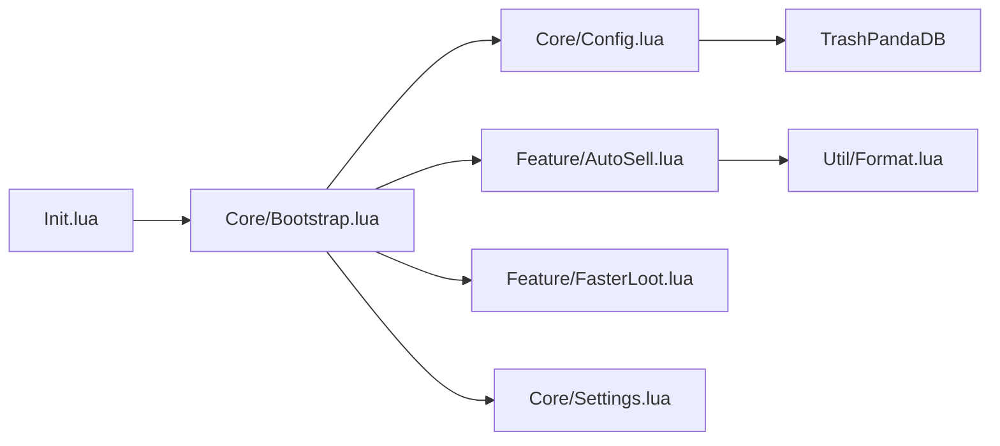

# Code graph

```mermaid
flowchart LR
  Init[Init.lua] --> Bootstrap[Core/Bootstrap.lua]
  Bootstrap --> Config[Core/Config.lua]
  Config --> DB[TrashPandaDB]
  Bootstrap --> AutoSell[Feature/AutoSell.lua]
  Bootstrap --> FasterLoot[Feature/FasterLoot.lua]
  AutoSell --> Format[Util/Format.lua]
  Bootstrap --> Settings[Core/Settings.lua]
```
