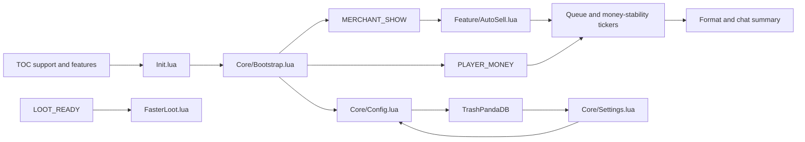

# Code graph

```mermaid
flowchart LR
  TOC[TOC support and features] --> Init[Init.lua]
  Init --> Bootstrap[Core/Bootstrap.lua]
  Bootstrap --> Config[Core/Config.lua]
  Config --> DB[TrashPandaDB]
  Bootstrap --> Merchant[MERCHANT_SHOW]
  Merchant --> AutoSell[Feature/AutoSell.lua]
  AutoSell --> Queue[Queue and money-stability tickers]
  Queue --> Summary[Format and chat summary]
  Bootstrap --> Money[PLAYER_MONEY]
  Money --> Queue
  Loot[LOOT_READY] --> Faster[FasterLoot.lua]
  DB --> Settings[Core/Settings.lua]
  Settings --> Config
```
